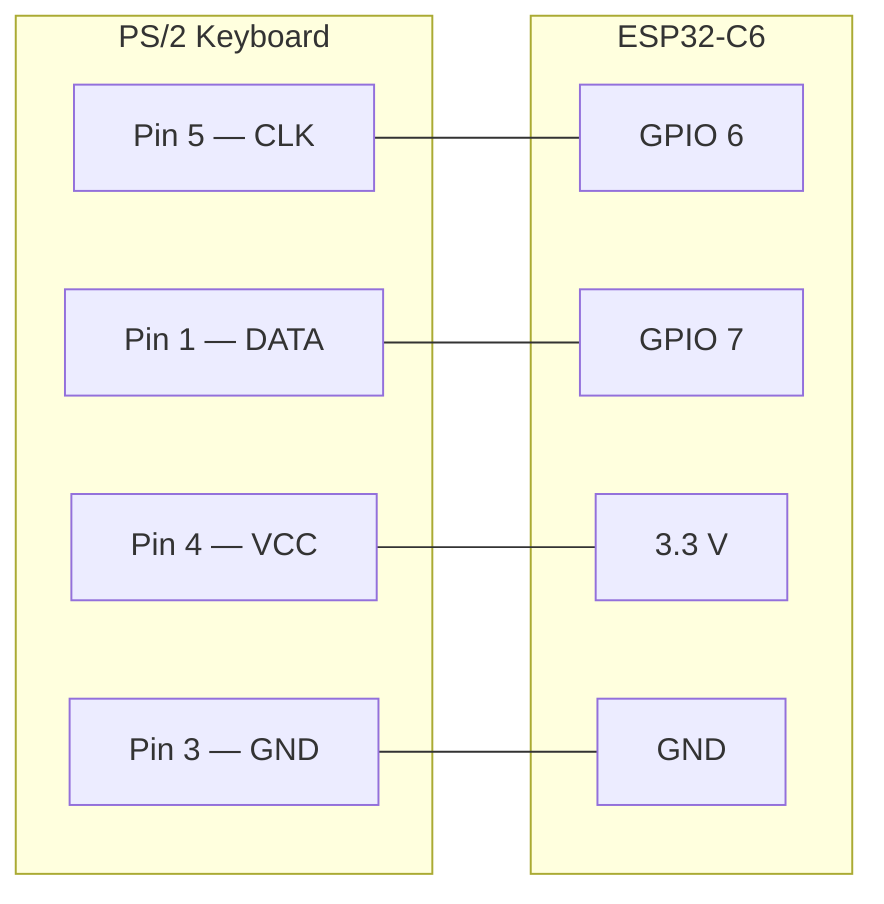
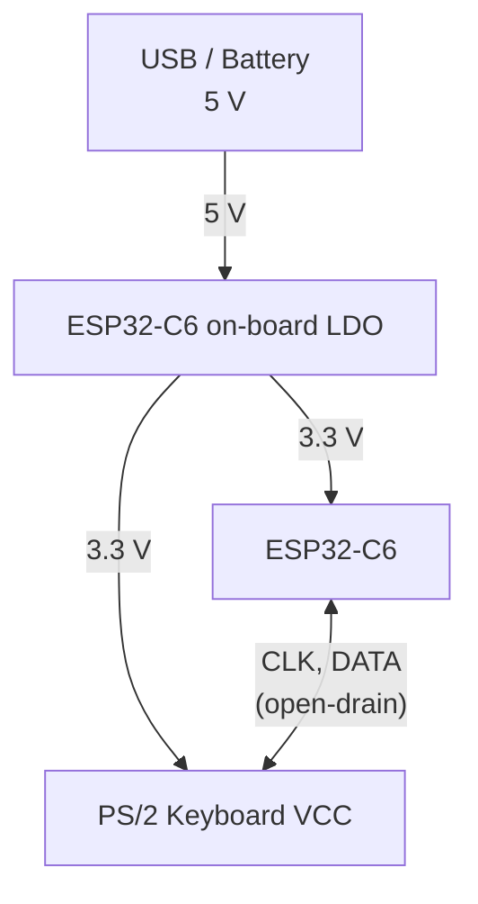
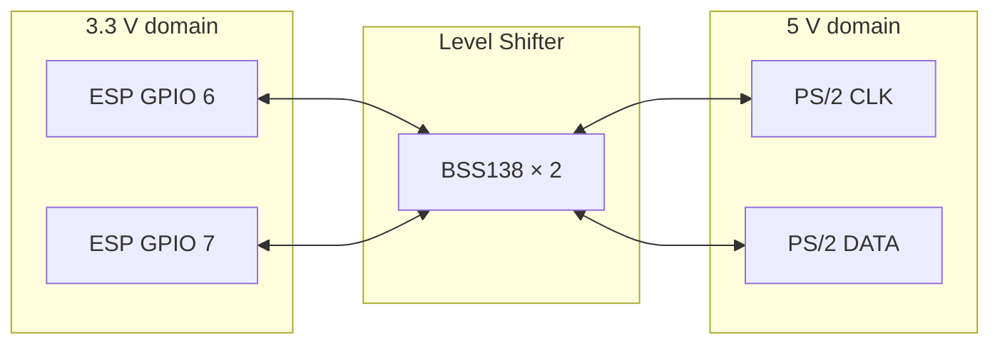
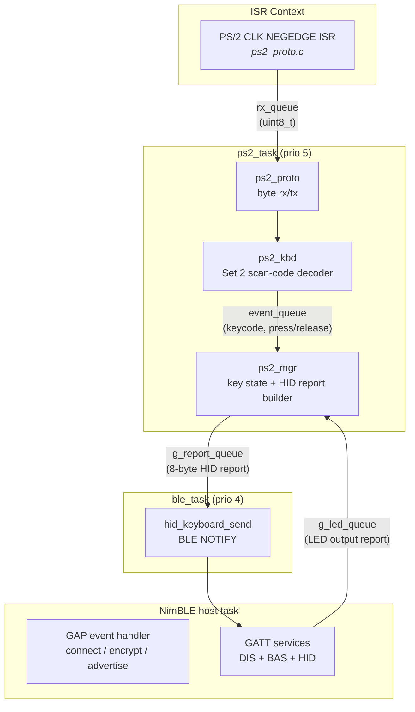
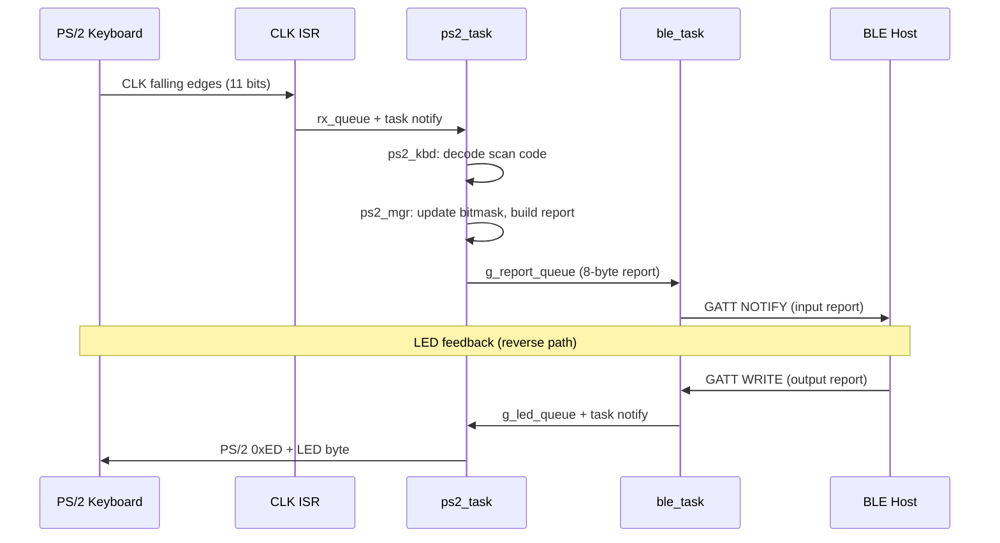
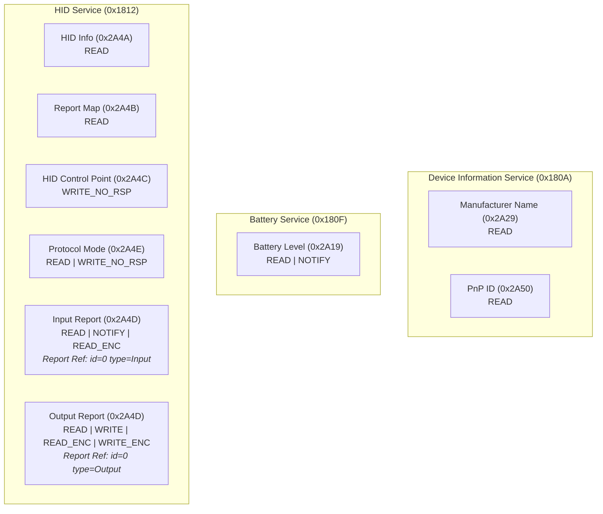
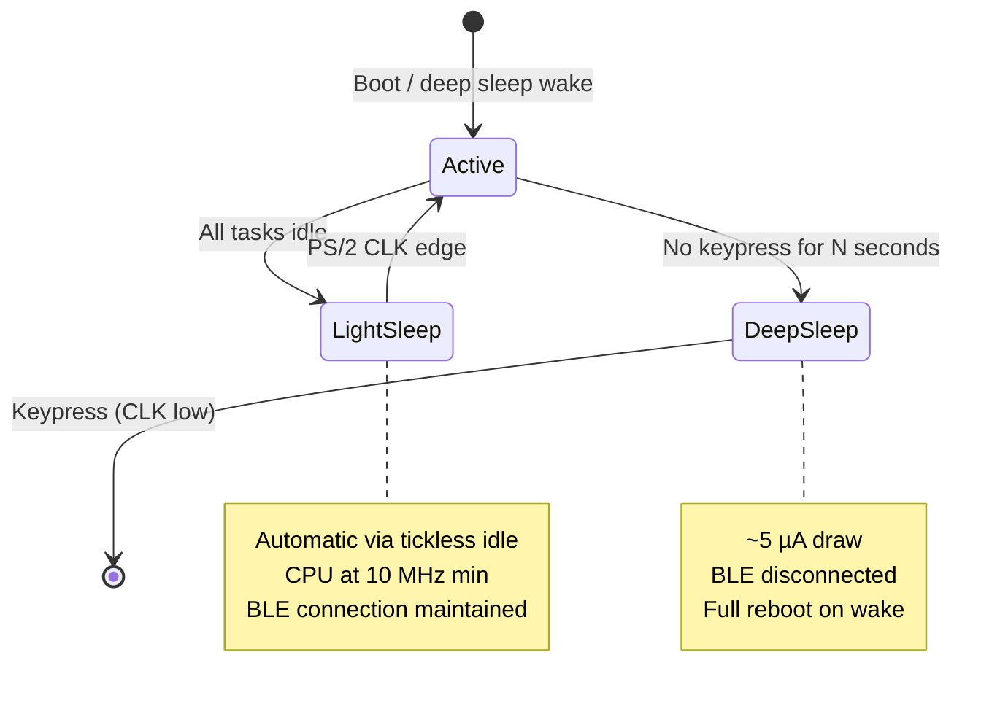

# PS/2 → BLE HID Keyboard (ESP32-C6)

Bridges a PS/2 keyboard to Bluetooth Low Energy HID using an ESP32-C6.
The host sees a standard wireless keyboard with encryption and bond persistence.

## Hardware

### Components

- ESP32-C6 development board (e.g. ESP32-C6-DevKitC-1)
- PS/2 keyboard (mini-DIN 6 connector)
- Jumper wires or breadboard
- (Optional) BSS138-based bidirectional level shifter if powering the keyboard at 5 V

### PS/2 Connector Pinout

Mini-DIN 6, viewed from the **plug** (cable) side:

```
     ┌─────┐
    / 6   5 \
   | 4     3 |
    \ 2   1 /
     └─────┘
```

| Pin | Signal |
|-----|--------|
| 1   | DATA   |
| 3   | GND    |
| 4   | VCC    |
| 5   | CLK    |
| 2, 6 | (n/c) |

### Wiring



| PS/2 Pin | Signal | ESP32-C6 | Notes |
|----------|--------|----------|-------|
| 5 | CLK  | GPIO 6 (default) | Open-drain, internal pull-up. Deep sleep wake source. |
| 1 | DATA | GPIO 7 (default) | Open-drain, internal pull-up. |
| 4 | VCC  | 3.3 V | See [Power](#power) below. |
| 3 | GND  | GND | |

> **CLK must be GPIO 0–7.** Deep sleep wakeup on the ESP32-C6 requires an
> LP (low-power) GPIO. GPIOs 0–7 are LP-capable; the DATA pin has no such
> restriction but defaults to GPIO 7 for convenience. Both pins are
> configurable via `idf.py menuconfig`.

### Power

Most PS/2 keyboards work at 3.3 V despite the spec calling for 5 V.
Powering from the ESP32-C6's 3.3 V rail is the simplest option:



If your keyboard requires 5 V, add a **bidirectional level shifter**
(e.g. BSS138 module) on CLK and DATA, and power the keyboard from 5 V:



> **ESP32-C6 GPIOs are NOT 5 V tolerant** (absolute max 3.6 V).
> Do not connect PS/2 lines directly when the keyboard is powered at 5 V.

## Architecture

### System Overview


### Software Components



### Keypress Data Flow



### BLE GATT Services



## Power Management

Three power states, entered automatically:



| State | Entry trigger | Current draw | BLE | Wake source |
|-------|---------------|-------------|-----|-------------|
| **Active** | Keypress / BLE event | ~30–80 mA | Connected | — |
| **Light sleep** | FreeRTOS idle (automatic) | ~1–3 mA | Maintained | PS/2 CLK GPIO |
| **Deep sleep** | No keypress for timeout | ~5 µA | Disconnected | PS/2 CLK GPIO (LP) |

After deep sleep wake the chip reboots. BLE re-advertises and the bonded
host reconnects automatically (bond keys persist in NVS). The first
keypress is consumed by the wake event.

## Build

```bash
. ~/esp/esp-idf/export.sh
idf.py -C src/ps2_ble_kbd build
idf.py -C src/ps2_ble_kbd flash monitor
```

## Configuration

```bash
idf.py -C src/ps2_ble_kbd menuconfig
```

Under **PS/2 Keyboard**:

| Option | Default | Range | Description |
|--------|---------|-------|-------------|
| `PS2_CLK_GPIO` | 6 | 0–7 | PS/2 clock GPIO. Must be LP-capable for deep sleep wake. |
| `PS2_DATA_GPIO` | 7 | — | PS/2 data GPIO. |
| `DEEP_SLEEP_TIMEOUT_SEC` | 300 | 30–3600 | Seconds of inactivity before deep sleep. |
